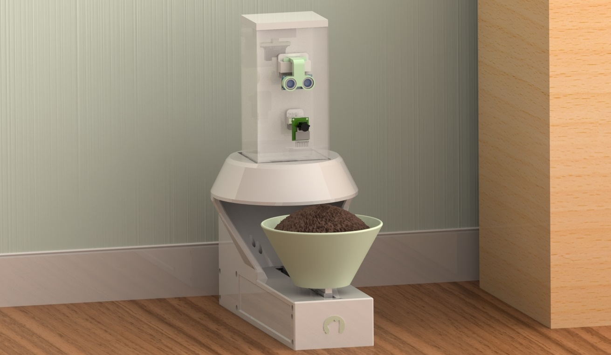

# Autonomous Pet Feeder
MREN 318 Fall 2024 - Final Project

### Contributors
Mechanical Design - [Ethan Varkul](https://www.linkedin.com/in/ethanvarkul) and [Will Steedman](https://www.linkedin.com/in/will-steedman)
Software Design - [Sabrina Button](https://sabrinabutton.ca)

## File Overview
- `main.ino`: Main file to run the pet feeder state machine
- `remote_cv.py`: Remote Flask server to send images from the Arduino to for computer vision processing
- `python_cv_server_check.ino`: Ensure that the Arduino can send images to the remote server
- `reset_eeprom.ino`: Reset the EEPROM on the Arduino in case changes need to be made

## CAD Renderings

## Software Demonstration
*MREN 318 - Pet Feeder Demo Speedrun on Youtube*

